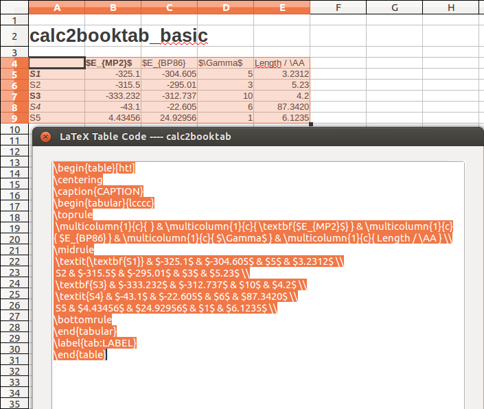

calc2booktab
============

A script for OpenOffice / Libreoffice Calc to convert tables to LateX-Code.

It can:

- Convert the selected cellrange to LaTeX-code
- Convert bold and italic cells to \\textbf{} and \\textit{}
- Format first row as \\multicolumn{1}{c} (e.g. for dcolumn)
- Keep user-set cell-alignment (center, left, right)
- First column will always be left if text, centered if numeric
- If dcolumn-package is used: Include correct column-definition
- Format all numeric cells with $..$
- Create tables with width fixed to x.x\\textwidth

HOW TO USE
------------
After installing the script you can run the macro in calc. You find the macro-menue at "Data" - "Macro" - "Run". Depending on the installation folder (share or user-folder) you find an entry with "calc2booktab" there. The script has 4 different functions that can be executed:

- calc2booktab\_basic
- calc2booktab\_dcolumn
- calc2booktab\_fixed
- calc2booktab\_fixed\_dcolumn

Names should explain the functionality. 

For most users calc2booktab\_basic is fine. It will convert the cells and format them for LaTeX. 

calc2booktab\_dcolumn adds functionality for numeric columns. Read the dcolumn-package manual for more information on what it does and how it is used (http://www.ctan.org/pkg/dcolumn). Please be aware that the script can only handle tables with one or zero columns of text. More text-columns will still be converted, but you have to adjust the dcolumn-definition in the code manually.

calc2booktab\_fixed will format the table header with the tabular\*-enviroment. The result will be a table with a fixed width. Default is 0.9\textwidth. If you want to use another standard-value, you can change this at the beginning of the calc2booktab.py-file. Have a look at the LaTeX-manual if you don't know this enviroment yet and want to learn more about it (for example: http://en.wikibooks.org/wiki/LaTeX/Tables).

calc2booktab\_fixed\_dcolumn combines both functionalities.

Why so many functions?
-----------------
So with this script, you can set 2 shortkeys, for example F3 and F4 (usually not assigned yet) for basic and dcolumn-function. Hit it, get your code. 

As an alternative, you can add a button to your toolbar to start the macro.

INSTALL
-------

So far the script is only available as source-file, you have to copy the calc2booktab.py into your LibreOffice/OpenOffice Scripts folder.

The folder relative to OpenOffice/libreoffice main is:

./share/Scripts/python

On Ubuntu and LibreOffice it can be found at

/usr/lib/libreoffice/share/Scripts/python

To install the script on Ubuntu, do:

$> sudo cp calc2booktab.py /usr/lib/libreoffice/share/Scripts/python

On Windows the folder should be at
C:\Program Files\libreoffice\share\Scripts\python

For further information and other systems:

<http://www.openoffice.org/udk/python/scriptingframework/>

Prerequisites for LaTeX-Header
------------------------------
In order for the tables to compile in LaTeX you need the following packages included:

\usepackage{booktabs}

If you want to align your numbers on your decimal point, use the dcolumn-Option and package

\usepackage{dcolumn}
